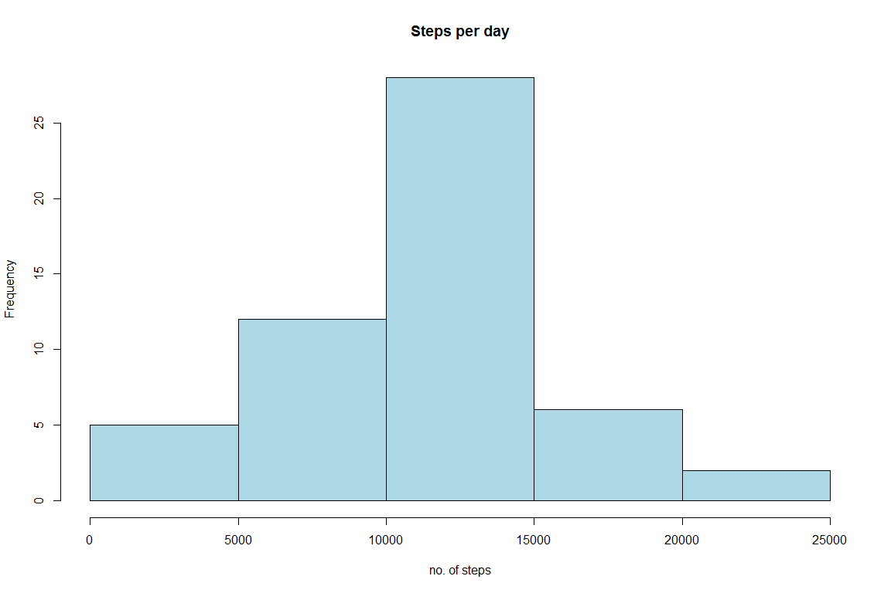
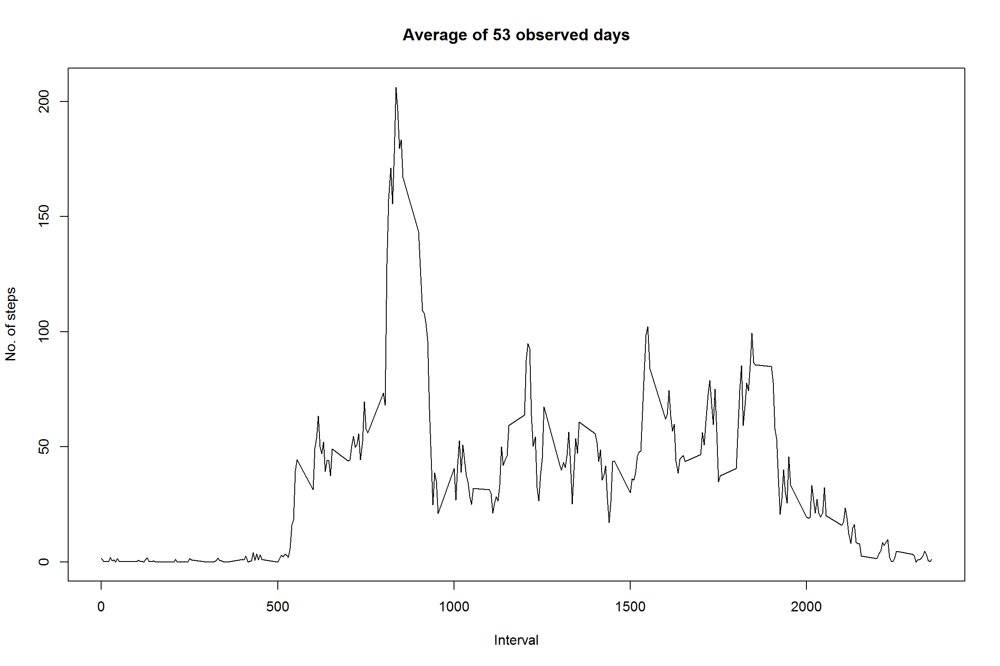
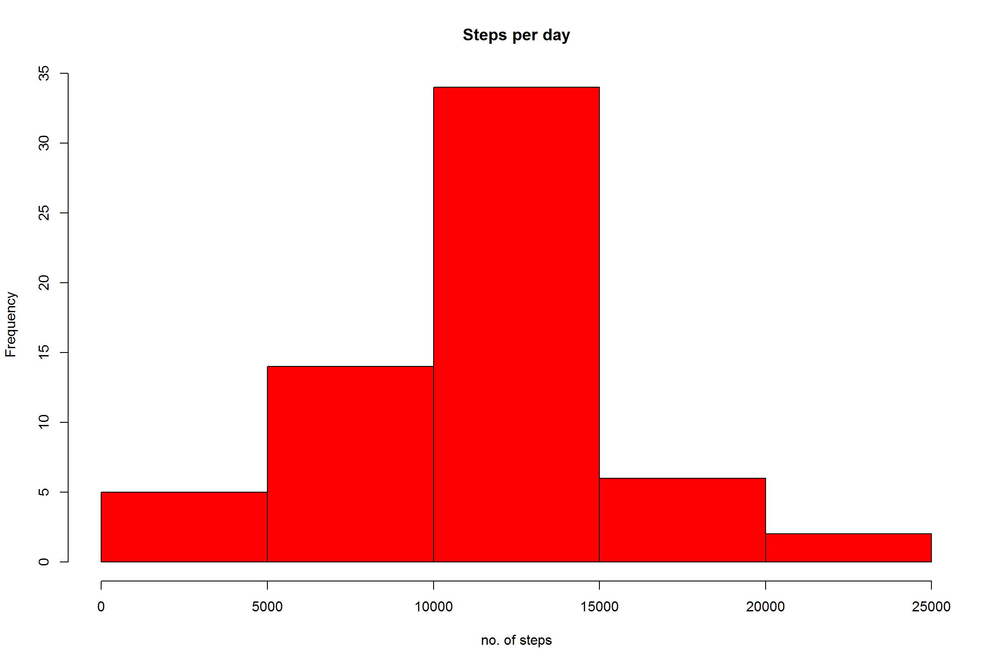
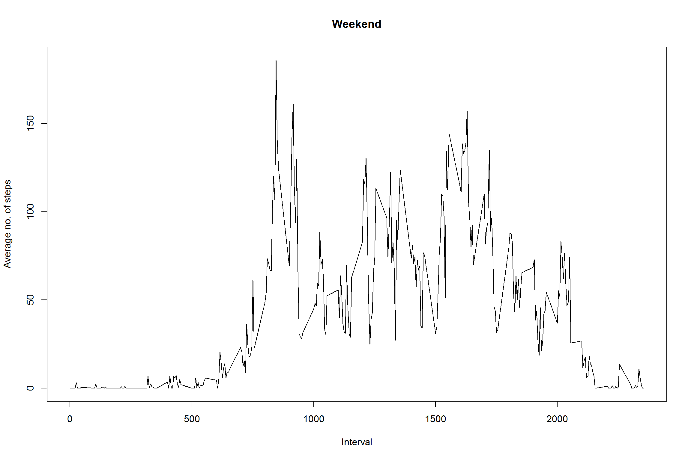
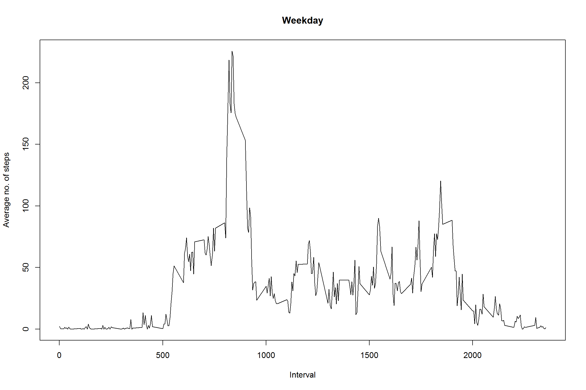

Assignment
-----------------------------------------------------
   
    knitr::opts_chunk$set(fig.width=12, fig.height=8, fig.path='figure/',
                          echo=TRUE, warning=FALSE, message=FALSE)

Loading and preprocessing the data
----------------------------------

The data are loaded from the working directory and the variable "date"
is transformed to class "Date"

    Data <- read.csv("activity.csv")
    Data$date <-as.Date(Data$date)

What is the mean total number of steps taken per day?
-----------------------------------------------------

1.  Histogram of the total number of steps taken each day

<!-- -->

    sumsteps<-aggregate(steps~date,Data,sum,na.rm=T)
    hist(sumsteps$steps, xlab="no. of steps",main="Steps per day",col="lightblue")

1.  Calculating the mean and median of total steps taken per day

<!-- -->

    mean(sumsteps$steps,na.rm = T)

    ## [1] 10766.19

    median(sumsteps$steps,na.rm=T)

    ## [1] 10765

What is the average daily activity pattern?
-------------------------------------------

1.  Number of steps taken averaged across all days and creating a series
    plot

<!-- -->

    meansteps<- aggregate(steps~interval,Data,mean,na.rm=T)
    plot(meansteps$interval,meansteps$steps,type = "l",xlab="Interval", ylab="No. of steps",main="Average of 53 observed days")

1.  Interval which contains the maximum number of steps

<!-- -->

    max_step_int <- meansteps[meansteps$steps==max(meansteps$steps),1]

Imputing missing values
-----------------------

1.  Number of missing values

<!-- -->

    count_na <- sum(is.na(Data))

1.  Strategy for filling in all of the missing values in the dataset and
    creating new dataset

We use the **Hmisc** package to impute the missing values and create an
new dataset "Data2"

    library(Hmisc)
    set.seed(1234)
    imp<-aregImpute(~steps+date+interval,Data)
    imputation <- as.vector(imp$imputed$steps[,5])
    Data2<-Data[order(Data$steps,na.last=F),]
    Data2$steps[1:count_na] <-imputation

1.  Histogram of the total number of steps taken each day and
    calculation of mean and median

<!-- -->

    sumsteps_im <- aggregate(steps~date,Data2,sum)
    hist(sumsteps_im$steps, xlab="no. of steps", main= "Steps per day",col="red")

    mean(sumsteps_im$steps)

    ## [1] 10780.49

    median(sumsteps_im$steps)

    ## [1] 10600

The average of steps taken slightly increases from **10766.19** (with
missing values excluded) to **10780.49** (missing values imputed).The
median of steps taken goes down from **10765** (missing values excluded)
to **10600** (missing values imputed).

Are there differences in activity patterns between weekdays and weekends?
-------------------------------------------------------------------------

1.  Creating a new factor variable with two levels "weekday" and
    "weekend"

<!-- -->

    Data2$wend <- (weekdays(Data2$date) == "Samstag") + (weekdays(Data2$date) == "Sonntag")
    Data2$wend <- sub(1,"weekend",Data2$wend)
    Data2$wend <- sub(0,"weekday",Data2$wend)
    weekend<-subset(Data2,wend=="weekend")
    weekday<-subset(Data2,wend=="weekday")

1.  Time series plot of the average number of steps taken grouped by
    wekend and weekday.

<!-- -->

    wend<-aggregate(steps~interval,weekend,mean) 
    wday<-aggregate(steps~interval,weekday,mean)
    plot(wend$interval, wend$steps,type="l",xlab="Interval", ylab="Average no. of steps", main="Weekend")

    plot(wday$interval, wday$steps,type="l",xlab="Interval", ylab="Average no. of steps", main="Weekday")

